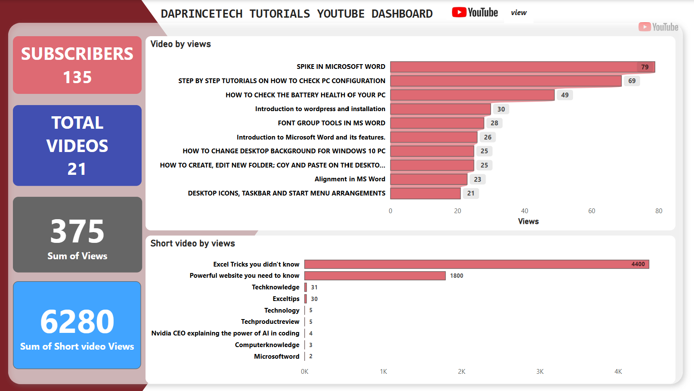

# my_youtubepage_analysis
This is the analysis of my IT youtube page to get insights from my page.

## Inroduction

In today's digital landscape, content creators must strategically analyze performance metrics to optimize growth and engagement. This YouTube dashboard provides valuable insights into the performance of DAPRINCETECH TUTORIALS, a tech-focused channel. By examining key metrics such as subscriber count, total videos, view distribution, and content engagement, we can identify trends that drive audience interaction.

From the data, it is evident that short-form content (YouTube Shorts) significantly outperforms long-form videos, with shorts contributing over 94% of total views. Additionally, Microsoft Office-related tutorials (Excel and Word) and tech tips generate the most traction, making them high-potential content categories for future uploads.

This analysis aims to answer critical business questions regarding content strategy, audience preferences, and engagement optimization. Based on these insights, recommendations will be made to help maximize subscriber growth, improve video visibility, and enhance content effectiveness. The goal is to develop a data-driven content strategy that ensures sustained growth and increased audience retention on the platform.

## Business Questions
1. What type of content performs best on the channel?
2. How does audience engagement compare between short and long videos?
3. What can be done to increase channel growth?
4. What content should be prioritized for future uploads?
5. How can the channel improve subscriber conversion?

## Datasets 📑
Data was collected from the youtube channel webpage using instant data scraper, then proceeds to the cleaning of the data to remove columns not needed and other irrelevant scraped data. Two tables was obtained via the channel webpage (The short and the main videos); using the ETL data processes. 

1. The youtube tutorial videos data consist of the following columns after cleaning:
- The Timestamp
- Video Title
- Views
- Duration

2. The short videos consist of the following columns:
- The video title
- views

*You can access the dataset* [here](https://github.com/Isaiah-99/my_youtubepage_analysis/blob/main/My_Youtubepage_combined.xlsx)

## Skills demonstrated:
- Data collection
- Data scraping
- Data cleaning
- Data transformation
- Data modelling
- Interactive Dashboard Creation using Power BI

  ## Visualization 📊
  
  Data visualization was created using power bi to derive hidden insights from the data.
  

  # Data Insights 💡

1. **Subscribers & Content Growth:**
- The channel has 135 subscribers and 21 total videos.
- There is potential for growth, especially with short videos performing significantly better than long-form videos.

2. **Video Views Performance:**
- The total views for regular videos are 375, whereas short videos have 6,280 views.
- The highest-performing regular video, "Spike in Microsoft Word," has 79 views, while the top short, "Excel Tricks You Didn't Know," has 4,400 views.

3. **Shorts Dominate Views:**
- Shorts are significantly outperforming regular videos in terms of engagement.
- The top two short videos alone have 6,200 views, compared to the entire long-form content which has only 375 views.

4. Popular Content Topics:
- Microsoft Word & Excel-related videos perform well (both in long-form and short videos).
- Technology tips and tutorials also attract engagement.
- Short-form content on "Excel Tricks" and "Powerful Websites" are the most successful.

## Conclusions
Short videos drive engagement more effectively than long-form content, and contribute over 94% of the total views, indicating that the audience prefers quick, digestible content.
Both long-form and short-form content about Microsoft Office tools attract more viewers compared to other topics. The channel has significant room for growth. 
With only 135 subscribers and high engagement on shorts, there is an opportunity to convert short-form viewers into subscribers.

## Recommendations:

1. **Increase the frequency of short video uploads.**
Since short videos drive the majority of views, focus on producing more content like "Excel Tricks", "Powerful Website You Need to Know", and other tech-related hacks.

2. **Optimize content for engagement and retention.**
- Use compelling thumbnails, engaging titles, and clear descriptions to attract and retain viewers.
- Add calls to action (CTA) in short videos encouraging viewers to subscribe.

3. **Experiment with long-form tutorials.**
- Given the success of Microsoft Office-related shorts, try long-form videos on Excel, Word, and PC tricks with a structured tutorial format.
- Break down longer tutorials into multiple short clips to drive traffic.

4. **Leverage social media for promotion.**
Share YouTube Shorts on platforms like TikTok, Instagram Reels, and Twitter to attract more viewers.

5. **Analyze audience behavior using YouTube Analytics.**
Identify watch time, retention rates, and viewer demographics to refine content strategy.

**By focusing on short videos, Microsoft Office tutorials, and audience engagement strategies, the channel can increase subscribers and overall watch time effectively.** 🚀

